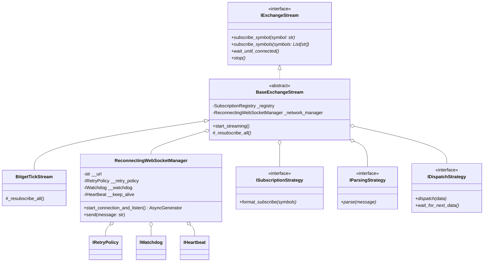

# Leviathan Streamers 🐳

[](https://www.python.org/)
[](#)
[](#)
[](#)
[](#)

A production-grade, highly resilient, and high-performance **Asynchronous Market Data Ingestion Engine** built in Python. Designed to capture, validate, and dispatch real-time digital asset trade feeds (specifically integrated with **Bitget WebSocket API**) under volatile market conditions.

---

## 🏗️ System Architecture & Design Patterns

The system is engineered using strict modular patterns to maximize class cohesion, minimize coupling, and guarantee 100% thread-safe asynchronous concurrency.



### Applied Patterns
1. **Factory Pattern (`BitgetStreamFactory`):** Centralizes the complex instantiations of the connection manager, parser strategies, and queues into a clean Composition Root.
2. **Strategy Pattern (`ISubscriptionStrategy`, `IParsingStrategy`, `IDispatchStrategy`):** Encapsulates varying protocols, deserialization techniques, and routing models.
3. **Template Method Pattern (`BaseExchangeStream`):** Defines the invariant skeleton of the real-time ingestion algorithm while leaving exchange-specific subscribe hooks (`_resubscribe_all`) to subclasses.
4. **Observer Pattern (`IPriceObserver`):** Allows loose coupling between incoming trade ingestion and downstream consumer engines (e.g., proprietary Order Flow or Execution calculation modules).

---

## 📜 Software Quality Charter (The 11 Pillars)

This engine is built around advanced academic software design principles rather than simple prototyping:

1. **Design by Contract (DbC):** Every public method enforces strong runtime preconditions (type checking by `isinstance` and value assertions), guarantees clear postconditions, and maintains strict class invariants.
2. **Strict Encapsulation (Name Mangling):** Internal implementation details and state (e.g., connection tasks, retry attempts) are secured behind Python double-underscore (`__`) prefixes, preventing unauthorized state corruption.
3. **Law of Demeter (Least Knowledge):** Elements only interact with immediate dependencies. Method chaining is strictly prohibited to keep components isolated.
4. **Single Responsibility Principle (SRP):** Network reconnections, JSON decoding, event parsing, symbol registries, and queue dispatching are isolated in autonomous, highly cohesive classes.
5. **Low Coupling & High Cohesion:** Strategy contracts allow swapping out JSON parsers (`orjson`), registries, or exchange targets without modifying a single line of core networking logic.
6. **Completeness:** Classes expose complete APIs naturally expected for their level of abstraction (e.g., `TradeTick` computes its own `notional` value; the stream provides a standard asynchronous iterator `__aiter__`).
7. **Convenience:** Common developer operations are streamlined (e.g., `subscribe_symbols` provides single-call batch subscriptions).
8. **Consistency:** Naming, exceptions (standard `TypeError` and `ValueError`), parameter orders, and error logging layouts are uniform across all system layers.
9. **Clarity:** Code is side-effect free, and dependencies are explicitly injected in constructors rather than relying on hidden singletons or global states.
10. **Class Autonomy:** Objects are self-governed and fully encapsulate the behavior and validation rules they own.
11. **Testing Levels (100% Coverage):** Maintained using Test-Driven Development (TDD) via unit, integration, and end-to-end system testing suites using a mock exchange server.

---

## ⚡ Quickstart & Interactive Demo

You don't need live API keys or external credentials to see the system's extreme resilience in action. A lightweight, simulated exchange server is packaged to demonstrate full network recovery.

### Run the Interactive Demo in 1 Command
Clone the repository and run the pre-packaged showcase script:

```bash
git clone https://github.com/TheRealDuBoySem/leviathan-streamers.git && cd leviathan-streamers && pip install -r requirements.txt && python demo.py
```

### What You Will See in the Demo:
1. **Mock Exchange Connection:** Client establishes an asynchronous WebSocket link.
2. **Batch Subscription:** Subscribes to `BTCUSDT` and `ETHUSDT` simultaneously.
3. **Simulated Network Crash:** The server forcibly kills the connection after 4 ticks.
4. **Resiliency Watchdog Event:** The `SilenceWatchdog` detects silence, prompting the connection manager to shut down the dead socket.
5. **Back-off Reconnection:** The `RetryPolicy` schedules back-off connections.
6. **Automatic Resubscription:** Upon reconnection, the stream automatically queries the `SubscriptionRegistry` and sends a fresh batch subscribe request, resuming the data feed seamlessly.

---

## 🧪 Running the Test Suite

Validate the 100% test coverage using pytest:

```bash
# Run all unit, integration, and system tests
pytest

# Generate complete coverage report
pytest --cov=. --cov-report=term-missing
```

---

## 💻 Sample Code Spotlight

### Elegant Consumption via Async Iteration
DOWNSTREAM consumer modules consume tick data using standard Pythonic async iterators, remaining completely decoupled from the WebSocket connections:

```python
streamer = BitgetStreamFactory.create_stream(url=WS_URL, symbols=["BTCUSDT", "ETHUSDT"])

# Start the connection loop
asyncio.create_task(streamer.start_streaming())

# Consume standard ticks seamlessly
async for tick in streamer:
    try:
        print(f"Ingested {tick.inst_id} at price {tick.price} (Notional: {tick.notional} USDT)")
    finally:
        # Mark task as processed for memory-bound queue bounds
        streamer.mark_tick_as_processed()
```

### Self-Validating Domain Models (Design by Contract)
```python
@dataclass(frozen=True)
class TradeTick:
    inst_id: str
    ts: int
    price: float
    size: float
    side: str
    trade_id: str

    def __post_init__(self):
        # Strict runtime type checks
        if not isinstance(self.inst_id, str): raise TypeError("inst_id must be a string")
        if not isinstance(self.ts, int): raise TypeError("ts must be an integer")
        if not isinstance(self.price, (int, float)): raise TypeError("price must be a number")
        
        # Strict business invariants assertions
        if self.ts <= 0: raise ValueError("ts must be positive")
        if self.price <= 0.0: raise ValueError("price must be positive")
        if self.side not in ("buy", "sell"): raise ValueError("side must be 'buy' or 'sell'")
```

---
*Developed under proprietary standards by **TheRealDuBoySem**. Designed to showcase core system design patterns for high-frequency algorithmic setups.*
